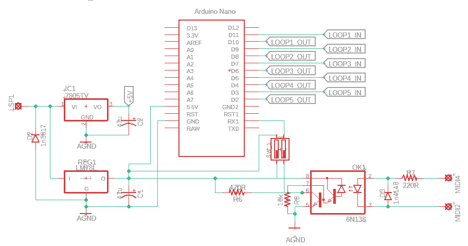
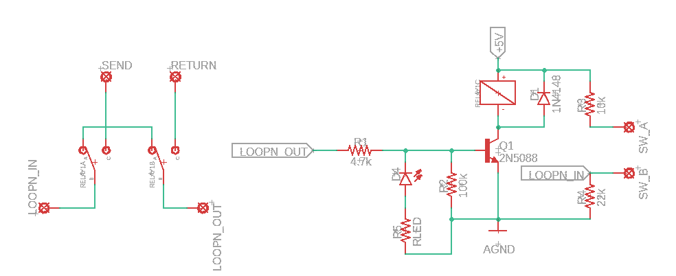
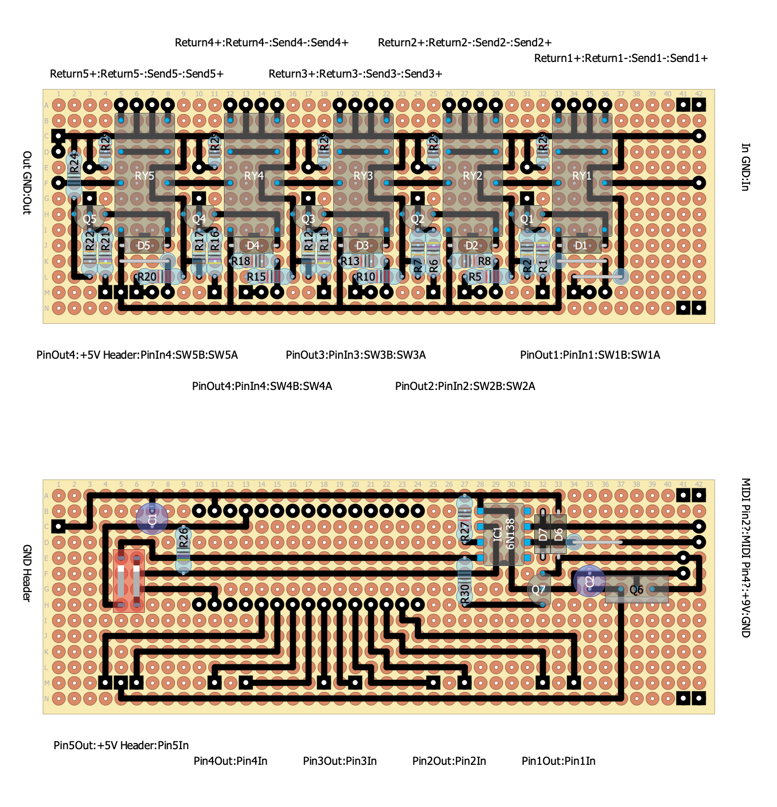

# Schematics

As you can see in the schematic below, it's really quite straightforward.

There's a provided `MLS_5.diy` file that can be opened in [DIY layout creator](https://github.com/bancika/diy-layout-creator).

The schematics can be split into two parts:

## Digital

## Relay Switching + LED

# Stacked PCB Design

